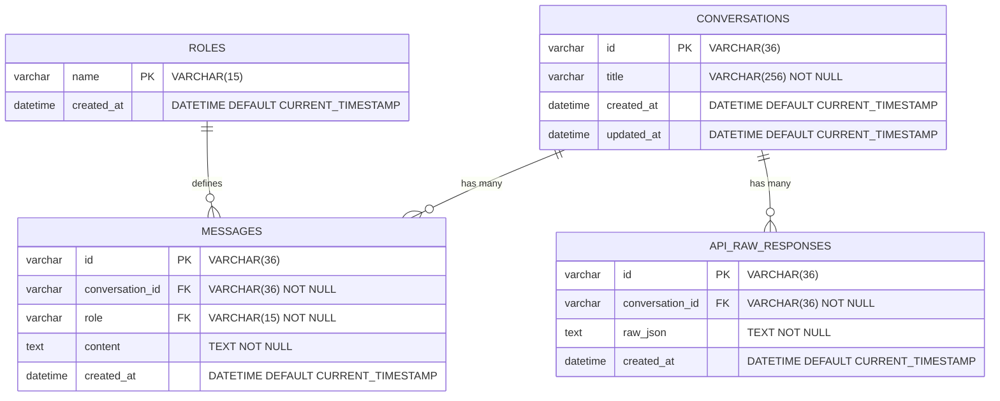
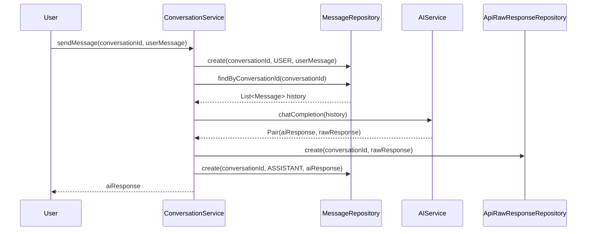

# Esquema do Banco de Dados - HexaSilith Chat

Este documento contém o diagrama ER (Entity-Relationship) do banco de dados da aplicação HexaSilith Chat.

## Diagrama de Entidades e Relacionamentos

## Descrição das Tabelas

### 📋 ROLES
- **Propósito**: Define os tipos de participantes nas conversas
- **Dados Iniciais**: SYSTEM, USER, ASSISTANT
- **Gerenciamento**: Criada e populada via Flyway migration V1

### 💬 CONVERSATIONS
- **Propósito**: Armazena informações das conversas
- **Características**: 
  - ID único (UUID)
  - Título gerado automaticamente a partir da primeira mensagem
  - Timestamps de criação e atualização
- **Gerenciamento**: Criada via Flyway migration V2

### 📝 MESSAGES
- **Propósito**: Armazena todas as mensagens das conversas
- **Relacionamentos**: 
  - Pertence a uma CONVERSATION
  - Tem um ROLE (SYSTEM, USER, ou ASSISTANT)
- **Características**: Ordenadas por timestamp para manter histórico
- **Gerenciamento**: Criada via Flyway migration V3

### 🔧 API_RAW_RESPONSES
- **Propósito**: Log das respostas brutas da API DeepSeek para debug
- **Relacionamentos**: Pertence a uma CONVERSATION
- **Características**: Armazena JSON completo da resposta da API
- **Gerenciamento**: Criada via Flyway migration V4

## Índices de Performance

### CONVERSATIONS
- `idx_conversations_updated_at` - Otimiza listagem por data de atualização

### MESSAGES
- `idx_messages_conversation_id` - Otimiza busca por conversa
- `idx_messages_created_at` - Otimiza ordenação temporal
- `idx_messages_conversation_created` - Índice composto para busca e ordenação

### API_RAW_RESPONSES
- `idx_api_raw_responses_conversation_id` - Otimiza busca por conversa
- `idx_api_raw_responses_created_at` - Otimiza ordenação temporal

## Fluxo de Dados

## Migrações Flyway

| Versão | Arquivo | Descrição |
|--------|---------|-----------|
| V1 | `V1__Create_roles_table.sql` | Cria tabela ROLES e insere dados iniciais |
| V2 | `V2__Create_conversations_table.sql` | Cria tabela CONVERSATIONS com índices |
| V3 | `V3__Create_messages_table.sql` | Cria tabela MESSAGES com FKs e índices |
| V4 | `V4__Create_api_raw_responses_table.sql` | Cria tabela API_RAW_RESPONSES |

## Constraints e Integridade

- **Chaves Estrangeiras**: Configuradas com `ON DELETE NO ACTION` para preservar integridade
- **UUIDs**: Utilizados como identificadores únicos para todas as entidades principais
- **Timestamps**: Automáticos em todas as tabelas para auditoria
- **Validação de Roles**: Garantida via FK para tabela ROLES

## Valores Pré-definidos

### ROLES
- `SYSTEM` - Mensagens do sistema (inserida em 2024-01-01 00:00:00)
- `USER` - Mensagens do usuário (inserida em 2024-01-01 00:00:01)
- `ASSISTANT` - Mensagens da IA (inserida em 2024-01-01 00:00:02)

---

*Diagrama gerado automaticamente baseado na estrutura atual do banco de dados*
