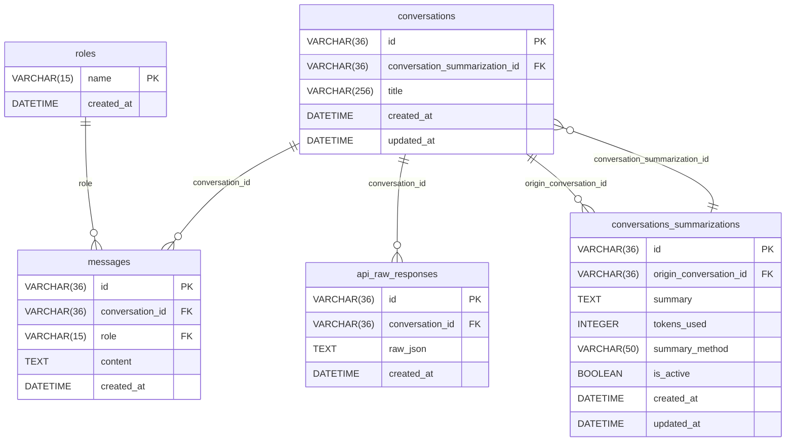
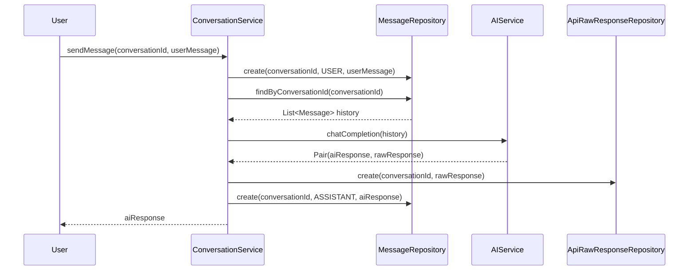

# Esquema do Banco de Dados - HexaSilith Chat

Este documento contém o diagrama ER (Entity-Relationship) do banco de dados da aplicação HexaSilith Chat.

## Diagrama de Entidades e Relacionamentos

```mermaid
erDiagram
    roles {
        VARCHAR(15) name PK
        DATETIME created_at
    }
    
    conversations {
        VARCHAR(36) id PK
        VARCHAR(36) conversation_summarization_id FK
        VARCHAR(256) title
        DATETIME created_at
        DATETIME updated_at
    }
    
    messages {
        VARCHAR(36) id PK
        VARCHAR(36) conversation_id FK
        VARCHAR(15) role FK
        TEXT content
        DATETIME created_at
    }
    
    api_raw_responses {
        VARCHAR(36) id PK
        VARCHAR(36) conversation_id FK
        TEXT raw_json
        DATETIME created_at
    }
    
    conversations_summarizations {
        VARCHAR(36) id PK
        VARCHAR(36) origin_conversation_id FK
        TEXT summary
        INTEGER tokens_used
        VARCHAR(50) summary_method
        BOOLEAN is_active
        DATETIME created_at
        DATETIME updated_at
    }

    roles ||--o{ messages : "role"
    conversations ||--o{ messages : "conversation_id"
    conversations ||--o{ api_raw_responses : "conversation_id"
    conversations ||--o{ conversations_summarizations : "origin_conversation_id"
    conversations }o--|| conversations_summarizations : "conversation_summarization_id"
```

## Descrição das Tabelas

### üìã ROLES
- **Propósito**: Define os tipos de participantes nas conversas
- **Dados Iniciais**: SYSTEM, USER, ASSISTANT
- **Gerenciamento**: Criada e populada via Flyway migration V1

### 💬 CONVERSATIONS
- **Propósito**: Armazena informações das conversas
- **Características**: 
  - ID √∫nico (UUID)
  - Título gerado automaticamente a partir da primeira mensagem
  - Timestamps de criação e atualização
- **Gerenciamento**: Criada via Flyway migration V2

### üìù MESSAGES
- **Propósito**: Armazena todas as mensagens das conversas
- **Relacionamentos**: 
  - Pertence a uma CONVERSATION
  - Tem um ROLE (SYSTEM, USER, ou ASSISTANT)
- **Características**: Ordenadas por timestamp para manter histórico
- **Gerenciamento**: Criada via Flyway migration V3

### üîß API_RAW_RESPONSES
- **Propósito**: Log das respostas brutas da API DeepSeek para debug
- **Relacionamentos**: Pertence a uma CONVERSATION
- **Características**: Armazena JSON completo da resposta da API
- **Gerenciamento**: Criada via Flyway migration V4
- 
### üîß CONVERSATIONS_SUMMARIZATIONS
- **Propósito**: Armazena resumos de conversas
- **Relacionamentos**: Pertence a uma CONVERSATION
- **Características**: Armazena resumo, tokens usados, método de resumo e status ativo/inativo
- **Gerenciamento**: Criada via Flyway migration V5

## Índices de Performance

### CONVERSATIONS
- `idx_conversations_updated_at` - Otimiza listagem por data de atualização

### MESSAGES
- `idx_messages_conversation_id` - Otimiza busca por conversa
- `idx_messages_created_at` - Otimiza ordenação temporal
- `idx_messages_conversation_created` - Índice composto para busca e ordenação

### API_RAW_RESPONSES
- `idx_api_raw_responses_conversation_id` - Otimiza busca por conversa
- `idx_api_raw_responses_created_at` - Otimiza ordenação temporal

## Fluxo de Dados

```mermaid
sequenceDiagram
    participant U as User
    participant C as ConversationService
    participant M as MessageRepository
    participant A as AIService
    participant R as ApiRawResponseRepository
    
    U->>C: sendMessage(conversationId, userMessage)
    C->>M: create(conversationId, USER, userMessage)
    C->>M: findByConversationId(conversationId)
    M-->>C: List<Message> history
    C->>A: chatCompletion(history)
    A-->>C: Pair(aiResponse, rawResponse)
    C->>R: create(conversationId, rawResponse)
    C->>M: create(conversationId, ASSISTANT, aiResponse)
    C-->>U: aiResponse
```

## Migrações Flyway

| Versão | Arquivo                                           | Descrição                                 |
|--------|---------------------------------------------------|-------------------------------------------|
| V1     | `V1__Create_roles_table.sql`                      | Cria tabela ROLES e insere dados iniciais |
| V2     | `V2__Create_conversations_table.sql`              | Cria tabela CONVERSATIONS com índices     |
| V3     | `V3__Create_messages_table.sql`                   | Cria tabela MESSAGES com FKs e índices    |
| V4     | `V4__Create_api_raw_responses_table.sql`          | Cria tabela API_RAW_RESPONSES             |
| V5     | `V5__Create_conversation_summarization_table.sql` | Cria tabela CONVERSATIONS_SUMMARIZATIONS  |

## Constraints e Integridade

- **Chaves Estrangeiras**: Configuradas com `ON DELETE NO ACTION` para preservar integridade
- **UUIDs**: Utilizados como identificadores √∫nicos para todas as entidades principais
- **Timestamps**: Autom√°ticos em todas as tabelas para auditoria
- **Validação de Roles**: Garantida via FK para tabela ROLES

## Valores Pré-definidos

### ROLES
- `SYSTEM` - Mensagens do sistema (inserida em 2024-01-01 00:00:00)
- `USER` - Mensagens do usu√°rio (inserida em 2024-01-01 00:00:01)
- `ASSISTANT` - Mensagens da IA (inserida em 2024-01-01 00:00:02)

---

*Diagrama gerado automaticamente baseado na estrutura atual do banco de dados*
