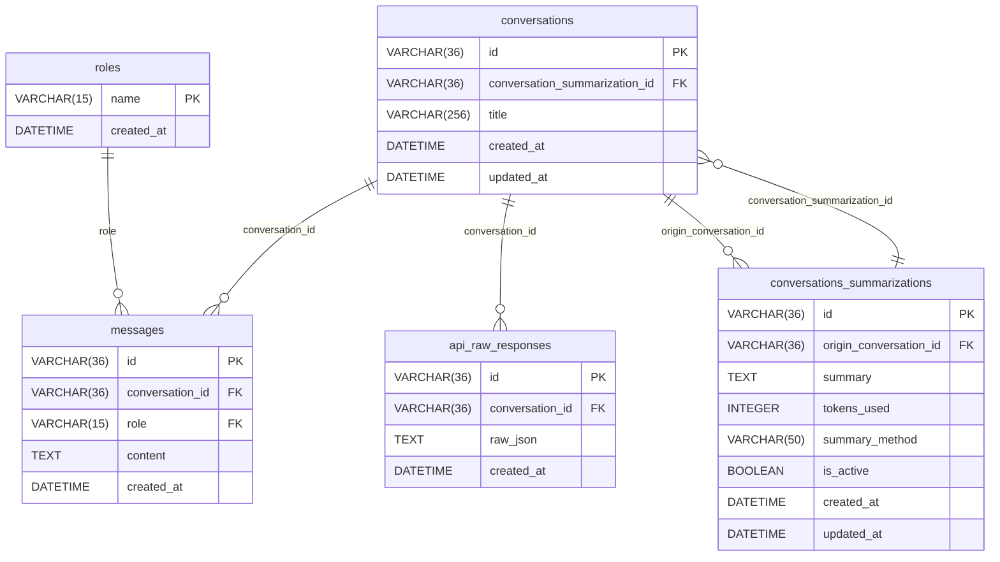
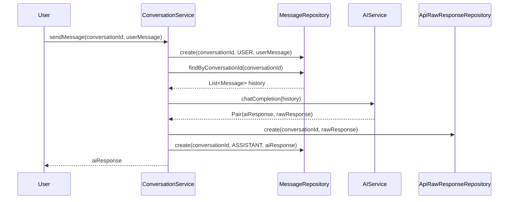
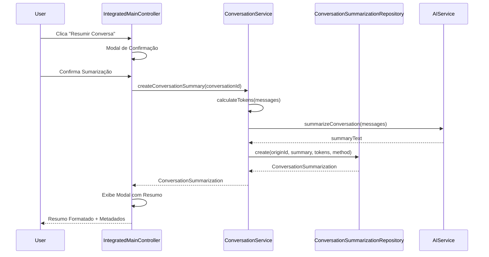

# Esquema do Banco de Dados - HexaSilith Chat

Este documento contém o diagrama ER (Entity-Relationship) do banco de dados da aplicação HexaSilith Chat, incluindo as funcionalidades de sumarização implementadas na Fase 4.

## Diagrama de Entidades e Relacionamentos



## Descrição das Tabelas

### 📋 ROLES
- **Propósito**: Define os tipos de participantes nas conversas
- **Dados Iniciais**: SYSTEM, USER, ASSISTANT
- **Características**: 
  - Chave primária composta (name)
  - Timestamp de criação para auditoria
- **Gerenciamento**: Criada e populada via Flyway migration V1

### 💬 CONVERSATIONS
- **Propósito**: Armazena informações das conversas
- **Características**: 
  - ID único (UUID)
  - Título gerado automaticamente a partir da primeira mensagem
  - Referência opcional para sumarização associada
  - Timestamps de criação e atualização para auditoria
- **Relacionamentos**: 
  - Pode ter uma sumarização associada (conversation_summarization_id)
  - Pode ser origem de múltiplas sumarizações
- **Gerenciamento**: Criada via Flyway migration V2

### 📝 MESSAGES
- **Propósito**: Armazena todas as mensagens das conversas
- **Relacionamentos**: 
  - Pertence a uma CONVERSATION (conversation_id)
  - Tem um ROLE específico (role: SYSTEM, USER, ou ASSISTANT)
- **Características**: 
  - Ordenadas por timestamp para manter histórico cronológico
  - Conteúdo armazenado como TEXT para suporte a mensagens longas
  - Suporte completo a conteúdo Markdown
- **Gerenciamento**: Criada via Flyway migration V3

### 🔧 API_RAW_RESPONSES
- **Propósito**: Log das respostas brutas da API DeepSeek para debug e auditoria
- **Relacionamentos**: Pertence a uma CONVERSATION (conversation_id)
- **Características**: 
  - Armazena JSON completo da resposta da API
  - Útil para debugging e análise de performance
  - Ordenado por timestamp (mais recentes primeiro)
- **Gerenciamento**: Criada via Flyway migration V4

### 🎯 CONVERSATIONS_SUMMARIZATIONS ✅ **NOVA**
- **Propósito**: Armazena resumos/sumarizações de conversas com metadados completos
- **Relacionamentos**: 
  - Pertence a uma conversa origem (origin_conversation_id)
  - Pode ser referenciada por conversas (conversation_summarization_id)
- **Características Avançadas**: 
  - **summary**: Conteúdo da sumarização (suporte a Markdown)
  - **tokens_used**: Controle preciso do consumo de tokens da API
  - **summary_method**: Rastreabilidade do método usado ('deepseek', 'auto', etc.)
  - **is_active**: Soft delete - permite desativar sem perder dados
  - **created_at/updated_at**: Auditoria completa de ciclo de vida
- **Funcionalidades**:
  - Permite múltiplas sumarizações por conversa
  - Controle de versioning através de is_active
  - Integração com sistema de tokens
  - Suporte a diferentes métodos de sumarização
- **Gerenciamento**: Criada via Flyway migration V5 ✅ **IMPLEMENTADA**

## Índices de Performance

### CONVERSATIONS
- `idx_conversations_created_at` - Otimiza listagem cronológica
- `idx_conversations_updated_at` - Otimiza listagem por última atividade
- `idx_conversations_conversations_summarization_id` - Otimiza busca por sumarização
- `idx_conversations_conversations_summarization_created` - Índice composto para ordenação
- `idx_conversations_conversations_summarization_updated` - Índice composto para última atividade

### MESSAGES
- `idx_messages_conversation_id` - Otimiza busca por conversa
- `idx_messages_created_at` - Otimiza ordenação temporal
- `idx_messages_conversation_created` - Índice composto para busca e ordenação otimizada

### API_RAW_RESPONSES
- `idx_api_raw_responses_conversation_id` - Otimiza busca por conversa
- `idx_api_raw_responses_created_at` - Otimiza ordenação temporal (DESC)

### CONVERSATIONS_SUMMARIZATIONS ✅ **NOVOS**
- `idx_conversations_summarizations_origin_conversation_id` - Busca por conversa origem
- `idx_conversations_summarizations_created_at` - Ordenação cronológica
- `idx_conversations_summarizations_updated_at` - Ordenação por atualização
- `idx_conversations_summarizations_is_active` - Filtro de sumarizações ativas
- `idx_conversations_summarizations_summary_method` - Filtro por método
- `idx_conversations_summarizations_origin_conversation_created` - Índice composto otimizado
- `idx_conversations_summarizations_origin_conversation_updated` - Índice composto para última atividade

## Fluxo de Dados

### Fluxo Principal de Chat


### Fluxo de Sumarização ✅ **NOVO**


## Migrações Flyway

| Versão | Arquivo | Descrição | Status |
|--------|---------|-----------|--------|
| **V1** | `V1__Create_roles_table.sql` | Cria tabela ROLES e insere dados iniciais | ✅ |
| **V2** | `V2__Create_conversations_table.sql` | Cria tabela CONVERSATIONS com índices | ✅ |
| **V3** | `V3__Create_messages_table.sql` | Cria tabela MESSAGES com FKs e índices | ✅ |
| **V4** | `V4__Create_api_raw_responses_table.sql` | Cria tabela API_RAW_RESPONSES | ✅ |
| **V5** | `V5__Create_conversation_summarization_table.sql` | ✅ **NOVA**: Cria tabela CONVERSATIONS_SUMMARIZATIONS | ✅ |

## Constraints e Integridade

### Chaves Estrangeiras
- **Configuração Padrão**: `ON DELETE NO ACTION` para preservar integridade referencial
- **messages.conversation_id** → conversations.id
- **messages.role** → roles.name
- **api_raw_responses.conversation_id** → conversations.id
- **conversations_summarizations.origin_conversation_id** → conversations.id ✅ **NOVA**
- **conversations.conversation_summarization_id** → conversations_summarizations.id ✅ **NOVA**

### Identificadores
- **UUIDs**: Utilizados como identificadores únicos para todas as entidades principais
- **Formato**: VARCHAR(36) para compatibilidade máxima com SQLite
- **Geração**: UUID.randomUUID() via código Kotlin

### Timestamps
- **Padrão**: DATETIME DEFAULT CURRENT_TIMESTAMP em todas as tabelas
- **Auditoria**: Campos created_at e updated_at onde aplicável
- **Fuso Horário**: LocalDateTime (sistema local)

### Validação de Dados
- **Roles**: Garantida via FK para tabela ROLES (SYSTEM, USER, ASSISTANT)
- **Booleanos**: is_active usando BOOLEAN com padrão 1 (true)
- **Textos**: TEXT para conteúdos longos, VARCHAR para identificadores

## Valores Pré-definidos

### ROLES
- `SYSTEM` - Mensagens do sistema (2024-01-01 00:00:00)
- `USER` - Mensagens do usuário (2024-01-01 00:00:01)
- `ASSISTANT` - Mensagens da IA (2024-01-01 00:00:02)

### CONVERSATIONS_SUMMARIZATIONS ✅ **NOVOS CAMPOS**
- **tokens_used**: Padrão 0, permitindo controle preciso de consumo
- **summary_method**: Padrão 'deepseek', permitindo diferentes provedores
- **is_active**: Padrão 1 (true), habilitando soft delete

## Funcionalidades por Tabela

### CONVERSATIONS
- ✅ Criação de conversas com título automático
- ✅ Listagem ordenada por última atividade
- ✅ Associação com sumarizações
- ✅ Timestamps de auditoria

### MESSAGES
- ✅ Armazenamento cronológico de mensagens
- ✅ Diferenciação por roles
- ✅ Suporte a conteúdo Markdown
- ✅ Histórico completo por conversa

### API_RAW_RESPONSES
- ✅ Log completo de interações com API
- ✅ Debug e análise de respostas
- ✅ Auditoria de chamadas

### CONVERSATIONS_SUMMARIZATIONS ✅ **FUNCIONALIDADES COMPLETAS**
- ✅ **Criação**: Geração automática com metadados
- ✅ **Persistência**: Armazenamento durável com soft delete
- ✅ **Controle de Tokens**: Monitoramento preciso de consumo
- ✅ **Múltiplos Métodos**: Suporte a diferentes provedores de sumarização
- ✅ **Versionamento**: Sistema is_active para gerenciar versões
- ✅ **Busca Inteligente**: Filtros por conversa, status e método
- ✅ **Auditoria Completa**: Timestamps de criação e atualização

## Queries Otimizadas

### Buscar Mensagens de Conversa (Ordenadas)
```sql
SELECT * FROM messages 
WHERE conversation_id = ? 
ORDER BY created_at ASC;
-- Usa: idx_messages_conversation_created
```

### Listar Conversas por Atividade
```sql
SELECT * FROM conversations 
ORDER BY updated_at DESC;
-- Usa: idx_conversations_updated_at
```

### Buscar Sumarizações Ativas ✅ **NOVA**
```sql
SELECT * FROM conversations_summarizations 
WHERE origin_conversation_id = ? 
  AND is_active = 1 
ORDER BY updated_at ASC;
-- Usa: idx_conversations_summarizations_origin_conversation_updated
```

### Métricas de Tokens por Método ✅ **NOVA**
```sql
SELECT summary_method, 
       COUNT(*) as total_summaries,
       SUM(tokens_used) as total_tokens,
       AVG(tokens_used) as avg_tokens
FROM conversations_summarizations 
WHERE is_active = 1 
GROUP BY summary_method;
-- Usa: idx_conversations_summarizations_summary_method
```

## Evolução do Schema

### Versão 1.0 (Inicial)
- ✅ Estrutura básica de chat (V1-V4)
- ✅ Roles, Conversations, Messages, API Responses

### Versão 1.1 (Fase 4) ✅ **ATUAL**
- ✅ Sistema completo de sumarização (V5)
- ✅ Controle avançado de tokens
- ✅ Múltiplos métodos de sumarização
- ✅ Soft delete para versionamento
- ✅ Índices otimizados para performance

### Versão 1.2 (Planejada)
- ⬜ Configurações de usuário
- ⬜ Temas e personalização
- ⬜ Histórico expandido de interações
- ⬜ Métricas e analytics

---

## 📊 Estatísticas do Schema

### Tabelas por Categoria
- **Core**: 2 tabelas (conversations, messages)
- **Auditoria**: 1 tabela (api_raw_responses)
- **Configuração**: 1 tabela (roles)
- **Funcionalidades**: 1 tabela (conversations_summarizations) ✅
- **Total**: 5 tabelas

### Índices por Performance
- **Simples**: 8 índices
- **Compostos**: 6 índices
- **Total**: 14 índices otimizados

### Relacionamentos
- **1:N**: 4 relacionamentos
- **N:1 Opcional**: 1 relacionamento
- **Total**: 5 relacionamentos bem definidos

---

*Diagrama e documentação atualizados para refletir o estado completo após implementação da Fase 4 - Sumarização de Conversas*

**Última atualização**: Janeiro 2025 - Passo 5 da Fase 4 concluído com sucesso
