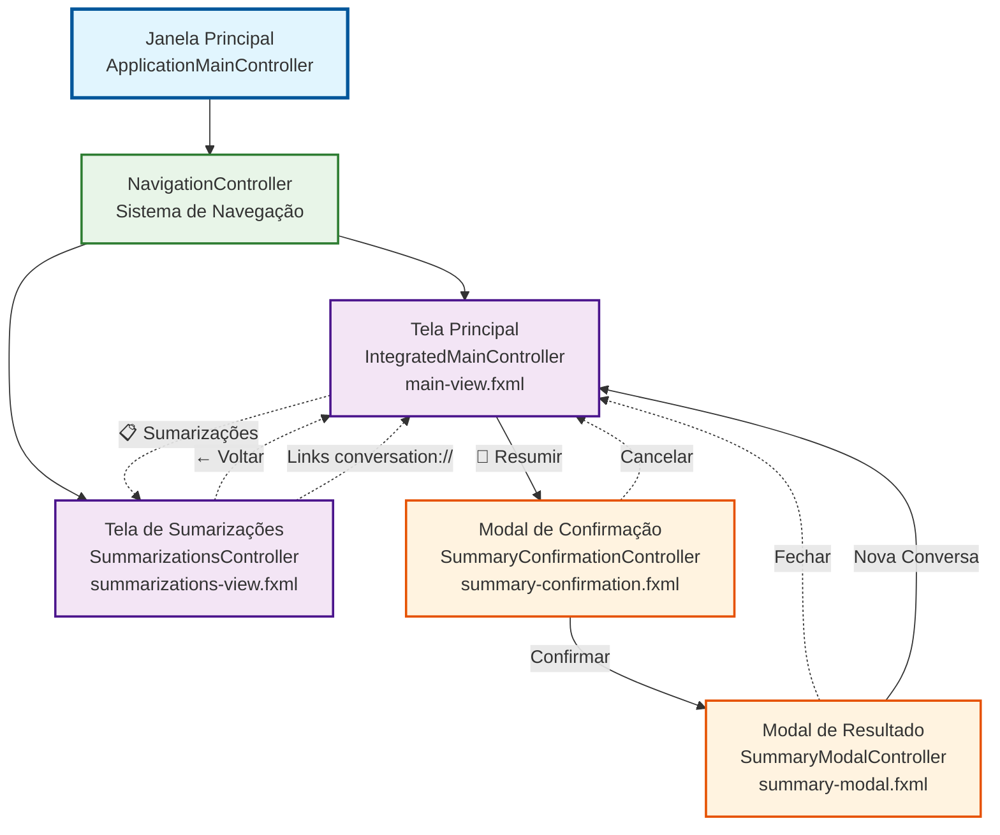
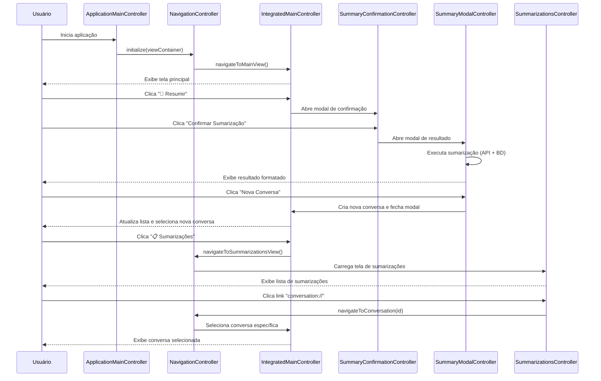
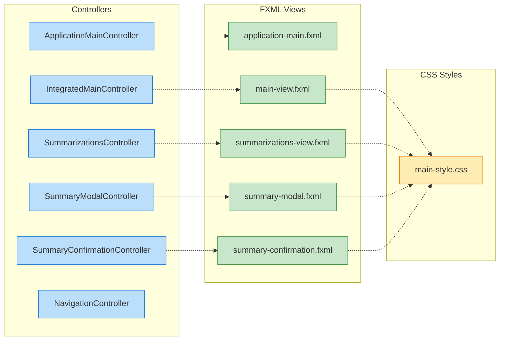
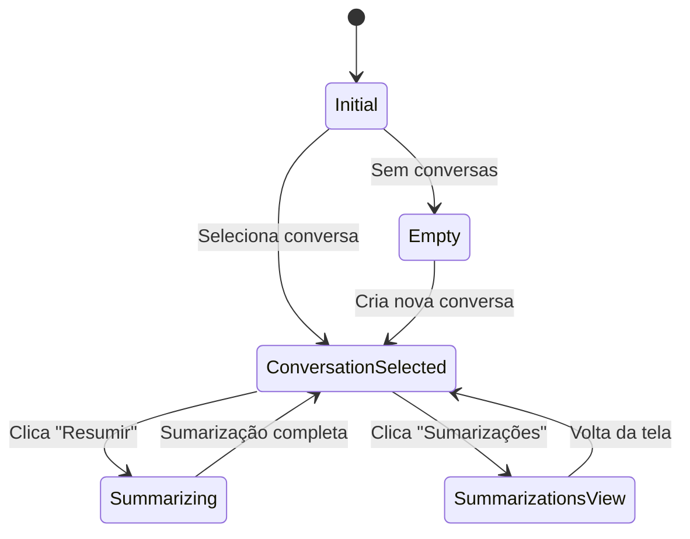
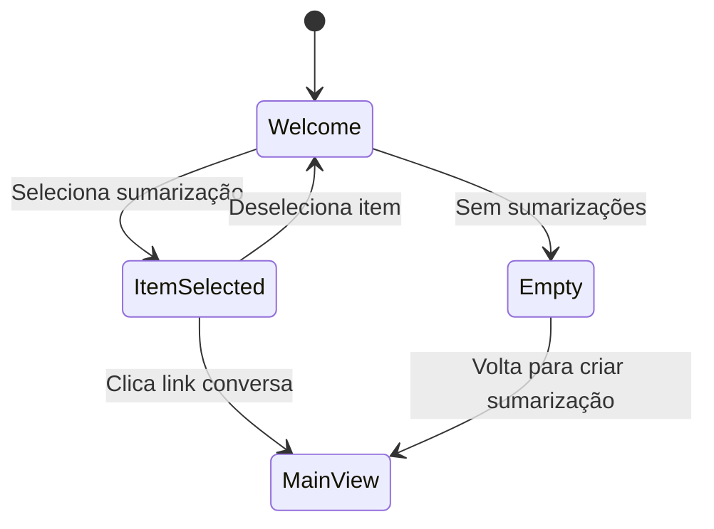

# Diagrama de Interface Gráfica - HexaSilith Chat

Este documento contém o diagrama de navegação e fluxos de interação da interface gráfica do projeto HexaSilith Chat, incluindo todas as janelas, telas e modais implementados.

## Visão Geral da Arquitetura GUI

O sistema utiliza uma **Single Window Application** com navegação centralizada através do `NavigationController`, suportando múltiplas views dentro de uma única janela principal.

## Diagrama de Navegação Principal



## Fluxo Detalhado de Interações



## Estrutura de Arquivos GUI



## Estados das Telas

### Tela Principal (IntegratedMainController)



### Tela de Sumarizações (SummarizationsController)



## Componentes de Interface por Tela

### 🏠 Tela Principal (main-view.fxml)
- **Sidebar Esquerda**: Lista de conversas
- **Área Central**: Chat com mensagens
- **Campo de Input**: Entrada de texto + botão enviar
- **Barra Superior**: Título da conversa + contagem de tokens
- **Botões de Ação**: 
  - 🔄 Resumir Conversa
  - 📋 Ver Sumarizações

### 📋 Tela de Sumarizações (summarizations-view.fxml)
- **Sidebar Esquerda**: Lista de sumarizações
- **Área Central**: Conteúdo da sumarização selecionada
- **Header**: Botão "← Voltar" + informações da seleção
- **Estados**:
  - Boas-vindas (sem seleção)
  - Vazio (sem sumarizações)
  - Conteúdo (sumarização selecionada)

### 🔍 Modal de Confirmação (summary-confirmation.fxml)
- **Título**: "Confirmar Sumarização"
- **Mensagem**: Explicação da operação
- **Botões**: "Confirmar Sumarização" | "Cancelar"

### 📊 Modal de Resultado (summary-modal.fxml)
- **Header**: Informações da conversa e tokens
- **Área de Conteúdo**: Sumarização formatada (Markdown)
- **Botões de Ação**:
  - 📋 Copiar
  - 💾 Exportar
  - 🆕 Nova Conversa
  - ❌ Fechar

## Navegação e Links Especiais

### Protocolo conversation://
- **Formato**: `conversation://uuid`
- **Função**: Links clicáveis para navegar entre conversas
- **Localização**: Mensagens de sumarização e tela de sumarizações
- **Comportamento**: Fecha tela atual e navega para conversa específica

### Callbacks de Navegação
```kotlin
// IntegratedMainController
onNavigateToSummarizations: () -> Unit

// SummarizationsController  
onBackToMainScreen: () -> Unit
onConversationLinkClick: (String) -> Unit

// SummaryModalController
onClose: () -> Unit
onNewConversationCreated: (Conversation) -> Unit
```

## Responsividade e Estados Visuais

### Contagem de Tokens
- **Verde**: 0-60% do limite (≤76.8k tokens)
- **Amarelo**: 60-80% do limite (76.8k-102.4k tokens)  
- **Vermelho**: 80-100% do limite (102.4k-128k tokens)

### Lista de Conversas
- **Item Selecionado**: Destacado em azul
- **Hover**: Efeito de destaque
- **Última Atividade**: Ordenação por `updated_at`

### Lista de Sumarizações
- **Tooltips**: Informações detalhadas no hover
- **Formatação**: Data, tokens, método e preview
- **Estados**: Ativo/Inativo com indicadores visuais

## Integração com Backend

### Chamadas Assíncronas
- **Sumarização**: API DeepSeek com feedback de progresso
- **Carregamento**: Listas e conteúdo via coroutines
- **Persistência**: SQLite com transações otimizadas

### Gerenciamento de Estado
- **Observables**: JavaFX ObservableList para listas dinâmicas
- **Atualizações**: Platform.runLater() para UI thread
- **Cache**: Reutilização de controllers para performance

---

## 📊 Estatísticas da Interface

### Telas Implementadas
- **1** Janela Principal (ApplicationMainController)
- **2** Views Principais (Main + Sumarizações) 
- **2** Modais (Confirmação + Resultado)
- **1** Sistema de Navegação (NavigationController)

### Arquivos de Interface
- **5** Arquivos FXML
- **6** Controllers
- **1** Arquivo CSS principal
- **1** Sistema de navegação centralizado

### Funcionalidades de Navegação
- ✅ Navegação entre telas na mesma janela
- ✅ Links internos com protocolo personalizado
- ✅ Modais de confirmação e resultado
- ✅ Estados dinâmicos (vazio, carregando, conteúdo)
- ✅ Callbacks para interação entre components

---

*Diagrama criado com base no estado atual da implementação da Fase 4 - Passo 8*

**Última atualização**: Janeiro 2025 - Sistema de navegação com tela única implementado